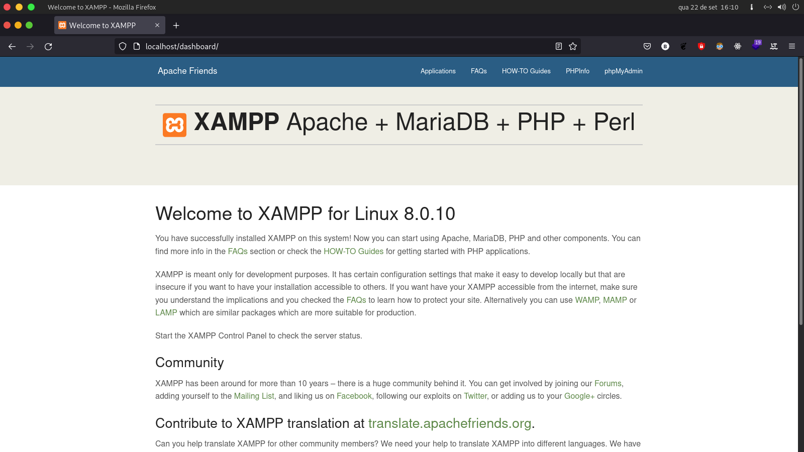
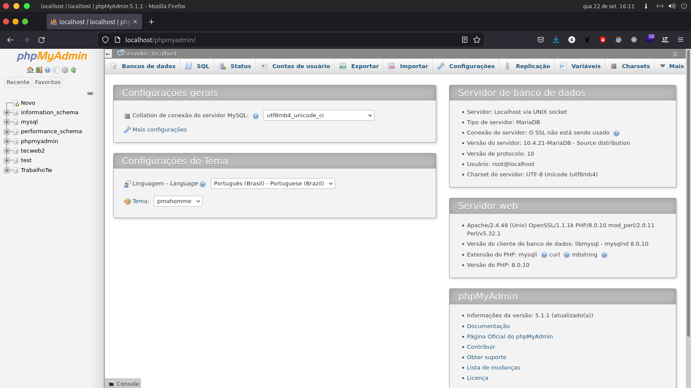
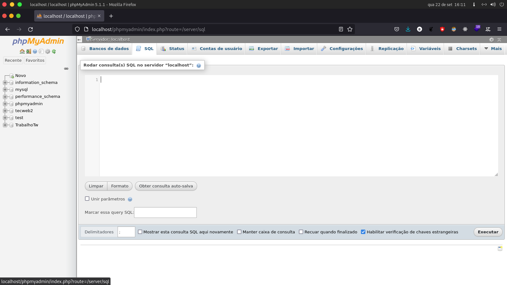
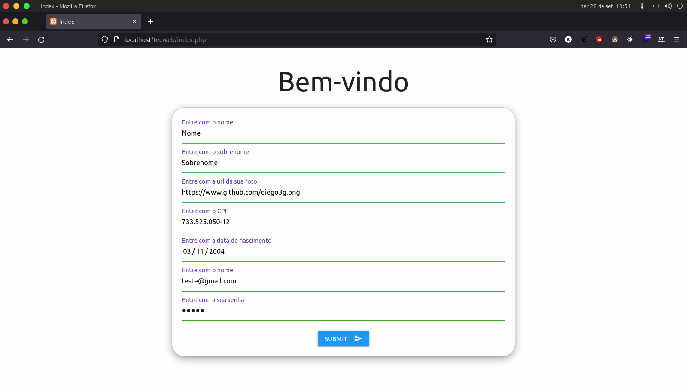
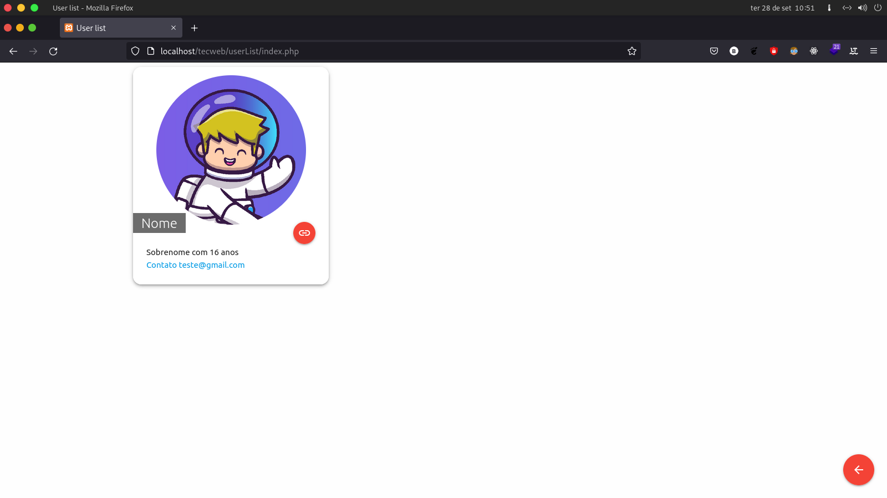
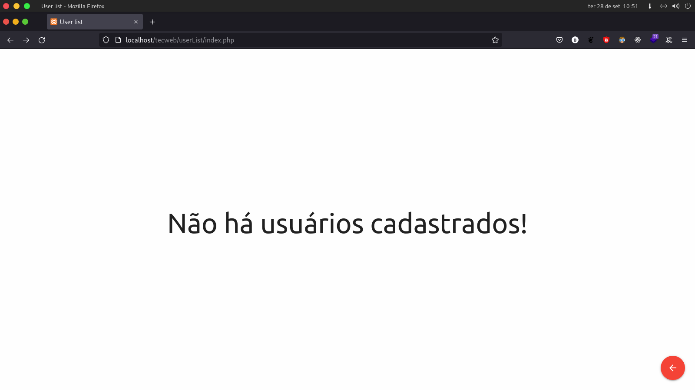

# Rodando Localmente
## Requerimentos
- [Xampp](https://www.apachefriends.org/pt_br/download.html)

## Como rodar?
- Inicialmente, instale e configure o Xampp, seguindo as instruções do site.
- Rode todos os os serviços do Xampp, como o MySQL, Apache, PHP, etc.
- Abra o navegador e acesse o endereço: http://localhost/
- Aparecerá essa página.
<p align="center">
  
</p>

## Configurando Banco de Dados
- Abra no navegador o endereço: http://localhost/phpmyadmin/
<p align="center">
  
</p>
- Clique em SQL.
<p align="center">
  
</p>
- Cole o comando abaixo:

```sql
drop database if exists TrabalhoTw;
create database if not exists TrabalhoTw;
use TrabalhoTw;

create table if not exists Usuario (
  id int NOT NULL AUTO_INCREMENT,
  firstName varchar(40) not null,
  lastName varchar(100) not null,
  birthDate date not null,
  email varchar(255) not null,
  password varchar(255) not null,
  Cpf varchar(14) not null,
  avatar varchar(1000) not null,
  PRIMARY KEY (id)
);

```
- Depois de criar o banco de dados, clique em "Executar".
- Volte para o http://localhost/tecweb/
- Pode cadastrar o usuário.


## Tecnologias

Esse projeto foi desenvolvido com as seguintes tecnologias:

- [php](https://www.php.net/)
- [Materialize](https://materializecss.com/)

## Resultado do Projeto

<p align="center">
  
</p>

<p align="center">
  
</p>
- Caso não tenha usuários listados, ao acessar a pagina de usuários, apareça a menssagem: "Nenhum usuário cadastrado."
<p align="center">
  
</p>
